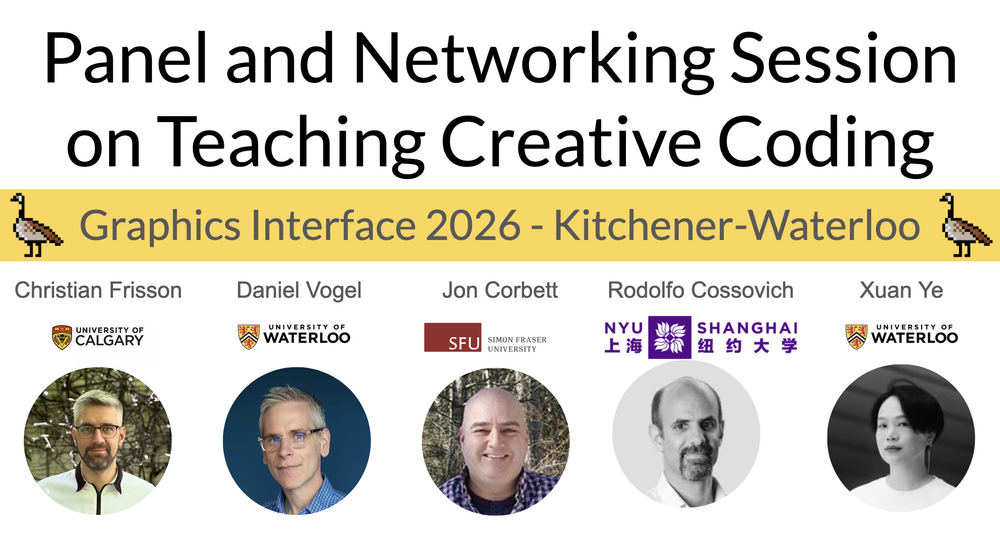
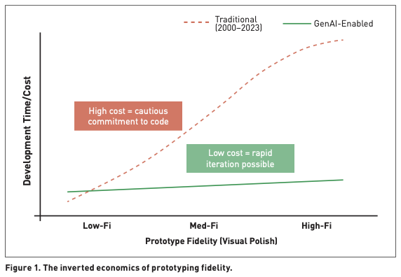
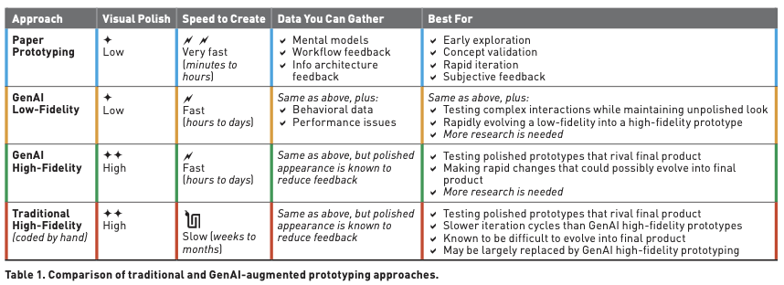
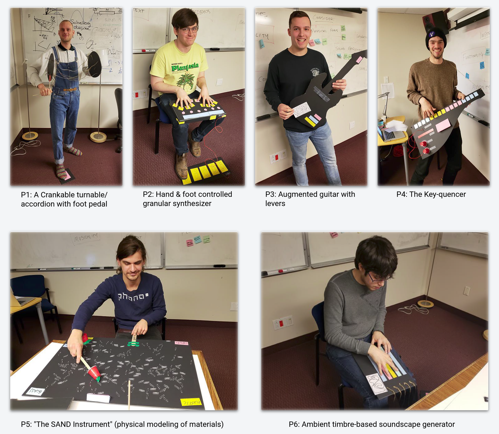
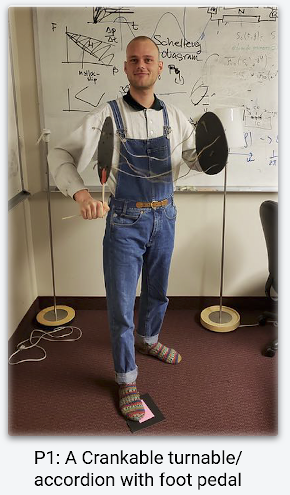
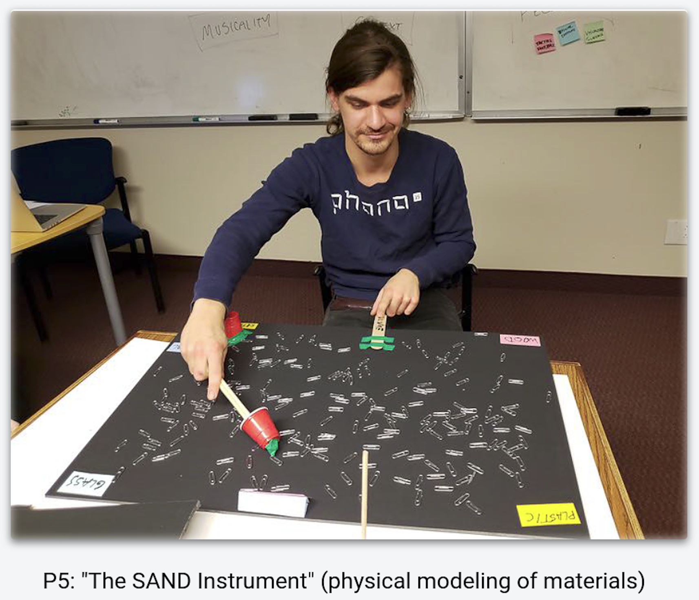

---
# Extends metadata from _quarto.yml
subtitle: "Course Introduction"
date: 2026-09-01
---

# Welcome

to CPSC 599+601 Creative Computing!


# Today's outline

- Introduction
- Course Information
- Installation

# Introduction

## What do we mean by Creative Computing?

[Creative Computing Curriculum, Harvard Graduate School of Education](https://scratched.gse.harvard.edu/guide/)

> Creative computing supports the development of personal connections to computing, by drawing upon creativity, imagination, and interests.

## Creative Computing (key computational thinking practices)

[Creative Computing Curriculum, Harvard Graduate School of Education](https://scratched.gse.harvard.edu/guide/)

> - Experimenting and iterating
> - Testing and debugging
> - Reusing and remixing
> - Abstracting and modularizing

## Creative Computing (GI's take)



## Creative Computing (our take)

<small>

- Learn by experience.
- Experience major ways (modalities) of interacting with computing  systems.
- Feed your mental model of design spaces for each component.
- Explore limits.
- Create unexpected results.

</small>

## A personal example


```{=html}
<iframe width="100%" height="166" scrolling="no" frameborder="no" allow=" encrypted-media" src="https://w.soundcloud.com/player/?url=https%3A//api.soundcloud.com/tracks/soundcloud%253Atracks%253A59259656&color=%23ff5500&auto_play=false&hide_related=false&show_comments=true&show_user=true&show_reposts=false&show_teaser=true"></iframe>
<div style="font-size: 10px; color: #cccccc;line-break: anywhere;word-break: normal;overflow: hidden;white-space: nowrap;text-overflow: ellipsis; font-family: Interstate,Lucida Grande,Lucida Sans Unicode,Lucida Sans,Garuda,Verdana,Tahoma,sans-serif;font-weight: 100;"><a href="https://soundcloud.com/christianfrisson" title="ChristianFrisson" target="_blank" style="color: #cccccc; text-decoration: none;">ChristianFrisson</a> · <a href="https://soundcloud.com/christianfrisson/genesis-model-wasp-swarm-wet-fire" title="Genesis model: snow steps? wasp swarm? wet fire?" target="_blank" style="color: #cccccc; text-decoration: none;">Genesis model: snow steps? wasp swarm? wet fire?</a></div>
```

<!-- source: https://soundcloud.com/christianfrisson/genesis-model-wasp-swarm-wet-fire  -->


## Your personal examples?

Ever felt drawn by unexpected or emergent processes in your work?

Anybody wants to share?

# Course Information

## Learning Outcomes

By the end of this course, students should be able to:

<small>

- understand how to source and share creative code from/into online repositories (such as GitHub);
- be able to build upon code developed in any appropriate development language (C++, JavaScript, Python);
- understand when (not) to use generative AI;
- know how to glue different modalities (audio, visual, touch, interaction) together with tools for sequencing and mapping;
- creative interactive artifacts via various levels of fidelity;
- fine-tune their skills in pitching creative ideas and showcasing creative artifacts.

</small>

## Format

- Half individual experiential hacks: for each **Lecture** with **Studio**, students individually hack interactive demos mostly from existing works (from a publication and/or GitHub) on the topic of the day (audio, vision, touch, interaction), then get to do an **Interactive Presentation** of their work (with a demo)
- Half group projects: with low- to high-fidelity prototyping, then **Interactive Presentation** (with a demo), then **Documentation** (a small GitHub Pages website, plus optional publication draft for grad students - course is cross-listed)



## Grading

<small>

| Component                 | Studio (Individual) | Project (Group) | Total         |
|------------------|------------------|------------------|------------------|
| Interactive Presentations | 20% (4 x 5%)        | 15% (3 x 5%)    | 35% (7 x 5%)  |
| Pitches                   | 15% (1 x 15%)       | 15% (1 x 15%)   | 30% (2 x 15%) |
| Documentation             | /                   | 20% (1 x 20%)   | 20% (1 x 20%) |
| Individual Reflection     | 15% (1 x 15%)       | /               | 15% (1 x 15%) |
| Total                     | 50%                 | 50%             | 100%          |

</small>

# Components

:::: {.columns}
::: {.column width="50%"}

- Lectures
- Studios
- Interactive Presentations
- Pitches
- Documentation

:::
::: {.column width="50%"}

, Communications Design Group SF, 2014.
</small>
](images/3rdparty/BretVictorResearchAgenda/ConceptRepresentationModes.png)

:::
::::

## Lectures

- Offer an introduction to creative computing concepts.
- 4 Lectures (audio, vision, touch, interaction) are also assorted to **Studios** where students individually hack interactive demos mostly from existing works (from a publication and/or GitHub) on the topic of the day, then get to present **Interactive Presentations** next class.

## Studios (Scope)

> Hack an existing example or project to experience its design space and to pique (y)our interest.

## Studios (Process)

<small>

- Install a well-established tool suggested during the studio.
- Explore artifacts (examples, patches, demos...) from the tool or GitHub.
- Pick one artifact and modify it creatively:
  - Focus on changes that will affect experience along the modality of the day.
  - Make the modality implementation more complex.
  - Combine examples if you wish!
- Prepare your interactive presentation.

</small>

## Interactive Presentations (Distribution)

Each Interactive Presentation weights 5% and is presented in class (presentation with demos).

- 4 x Studio (Individual): Audio (Sep 22), Vision (Sep 29), Touch (Oct 6), Interaction (Oct 13). 
- 3 x Project (Group): Low-fidelity Prototype Showcase (Oct 27), High-fidelity Prototype Showcase (Nov 17), Final Version Showcase (Dec 1).

## Interactive Presentations (Content)

- Clarify the provenance (what example(s) you used).
- Explain your intent, design idea.
- Describe your creative updates.
- Overview what you might have done next with more time.

## Pitches

Each Pitch weighs 15% and is presented in class (simple presentation). 

<small>

- 1 x (Personal) Pitch (Course Expectations and Project Ideation) (Sep 15) 
  - What creative computing aspects drive you individually?
  - What kind of project you'd like to collaborate on later in a group?
- 1 x (Group) Pitch (Project Ideation) (Oct 20)
  - What creative computing artifact do you want to create in a group?
  - What is your team composition and how will you plan your collaboration?

</small>

## Documentation

- The Documentation assessment consists in creating a simple static website (GitHub Pages) to showcase group projects, featuring content and sections to be further explained in class. 
- Students (particularly graduate students, as this course is cross-listed) can choose to also draft a related publication if they want to, or continue their group project as research projects throughout and after the term. 
- If they do so, students should obtain consent from both their supervisor and the course instructor for co-authorship inclusion at their discretion.

## Individual Reflection

A small report with:

<small>

- a retrospective on your own Course Expectations: 
  - How did your Individual and Group Project Ideations evolve to a Showcase? 
  - Did Studios and Interactive Presentations help experientially shape your progress?
- peer reviews and self reviews after group projects:
  - If reviews indicate that members of the group did not contribute as fully as others, they may be given a lower grade for the project. 
  - In these cases, the instructor will discuss the contribution discrepancy with the group to help determine the grade for each member of the group.

</small>

# Policies

These policies are in the course outline that is our learning contract.

## Course Communication

<small>

> Students must use their UCalgary account for all course correspondence.  
> 
> Please **read these instructions before contacting the teaching team** (instructor and teaching assistants):
> 
> - Students should **use in priority Microsoft Teams public conversations** in the [CPSC 599+601 Creative Computing Fall 2026 Teams team](https://teams.microsoft.com/l/team/19%3AI_wfQGgc9SpgeZ1U25WDE5T7RaWeOL2UC1XwLfjxX-U1%40thread.tacv2/conversations?groupId=a2d08ca1-4858-43f6-a36b-14bc29603042&tenantId=c609a0ec-a5e3-4631-9686-192280bd9151) so that contents can benefit all students, **except for private matters that should be sent via email only**.
> - Students should **contact the teaching team via email only for private matters, must specify "**[**CPSC 599+601 Creative Computing**](https://teams.microsoft.com/l/team/19%3AYU-e4TEa6ApFvWlHn0r4D6VqFDigUPNu_uUgIN6Q1vI1%40thread.tacv2/conversations?groupId=6c04334e-dc68-4533-a986-962fd49715f9&tenantId=c609a0ec-a5e3-4631-9686-192280bd9151)**" in the email subject, and they should include their full name and UCID in their request**.
> - Instructors reserve the right to disregard correspondences that do not follow these requirements.

</small>

## Missed Course Assessments 

<small>

> Students absent from an Interactive Presentations or Pitches will receive a grade of 0 for that presentation, unless alternative arrangements have been made (such as submitting a pre-recorded video of their presentation before the presentation day, or arranging for carrying over grades from next Interactive Presentations or Pitches, at the discretion of the instructor).
> 
> Unless alternative arrangements have been made, late submissions will be graded as follows:
> 
> - After the deadline up to 24 hours late: -25%
> - After 24 hours up to 48 hours late: -50%
> - Over 48 hours late: -100% (i.e., not accepted)

</small>

## Acceptable & Prohibited Tools & Resources

>  Generative AI is permitted as long as student disclose their use: student will need to mention each prompt and the tools / models they employed.

# Prototype Fidelity (and GenAI)

## Prototype Fidelity and GenAI (Insights)

:::: {.columns}
::: {.column width="20%"}
 July-August 2026.
](images/3rdparty/ACM-Interactions-Jul-2026-Cover.jpg)
:::
::: {.column width="80%"}
<object data="images/3rdparty/ACM-Interactions-Jul-2026-Excerpt.svg"></object>
:::
::::

## Prototype Fidelity and GenAI (Trend)

:::: {.columns}
::: {.column width="20%"}
 July-August 2026.
](images/3rdparty/ACM-Interactions-Jul-2026-Cover.jpg)
:::
::: {.column width="80%"}

:::
::::

## Prototype Fidelity and GenAI (Table)

:::: {.columns}
::: {.column width="20%"}
 July-August 2026.
](images/3rdparty/ACM-Interactions-Jul-2026-Cover.jpg)
:::
::: {.column width="80%"}

:::
::::

## Prototype Fidelity and GenAI (Disembodiment)

:::: {.columns}
::: {.column width="20%"}
 September-October 2026.
](images/3rdparty/ACM-Interactions-Sep-2026-Cover.jpg)
:::
::: {.column width="80%"}
<object data="images/3rdparty/ACM-Interactions-Sep-2026-Disembodied-Excerpt.svg"></object>
:::
::::

## Prototype Fidelity (Physicality)

:::: {.columns}
::: {.column width="30%"}
<small>
What if our artifacts are physical?

. Computer Music Journal (2022) 46 (3): 26–47
](images/3rdparty/2022-CMJ-cover.jpg){width="50%"}

</small>
:::
::: {.column width="70%"}

<small>
MUMT 620 2018 course assignment with John Sullivan and <a href="https://www.collinwang.com/workshop">Collin Wang</a>
</small>
:::
::::

## Prototype Fidelity (Evolution) {.scrollable}

<small>
Mathias K. (P1) and Mathias B. (P5)'s low-fidelity prototyping for MUMT 620 shaped their master thesis.
</small>

:::: {.columns}
::: {.column width="34%"}

:::
::: {.column width="66%"}

:::
::::

:::: {.columns}
::: {.column width="33%"}
 (NIME'20)
](images/3rdparty/TorqueTunerNIME2020-400x400.png)
:::
::: {.column width="33%"}
 (NIME'21)
](images/3rdparty/webmapper-maplooper-400x400.png)
:::
::: {.column width="33%"}
 (HCII'20)
](images/3rdparty/CIRMMT-SpeakerSeriesVis-400x400.jpg)
:::
::::

## Prototype Fidelity (Example)

<iframe title="vimeo-player" src="https://player.vimeo.com/video/404592134?h=83ffa25692" width="640" height="360" frameborder="0" referrerpolicy="strict-origin-when-cross-origin" allow="autoplay; fullscreen; picture-in-picture; clipboard-write; encrypted-media; web-share"   allowfullscreen></iframe>

## Examples of modalities and tools

Supporting creative artifacts at the [{.logo}](https://sat.qc.ca) 

```{=html}
<iframe width="100%" height="100%" src="web/sat-mtl-tools" title="SAT MTL Tools" style="background:white;"></iframe>
```
<!-- Source: [sat-mtl.gitlab.io](https://sat-mtl.gitlab.io) -->

# Next steps

## Software tools

- Install [Visual Studio Code](https://code.visualstudio.com/) or [VSCodium](https://vscodium.com/) on your machine!
- Install vscode extensions:
  - [Quarto](https://github.com/quarto-dev/quarto.git#main): to create **Interactive Presentations** and **Pitches** ([revealjs](https://revealjs.com)) from Markdown.
  - [C/C++](https://github.com/microsoft/vscode-cpptools) PLUS [extra compiler installation](https://github.com/microsoft/vscode-cpptools#overview-and-tutorials) needed for the ([*Touch*](lecture-touch.html): Haptics) **Studio**.
  - [LTeX+](https://github.com/ltex-plus/vscode-ltex-plus.git): grammar/spell checking using LanguageTool.
