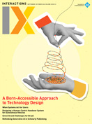
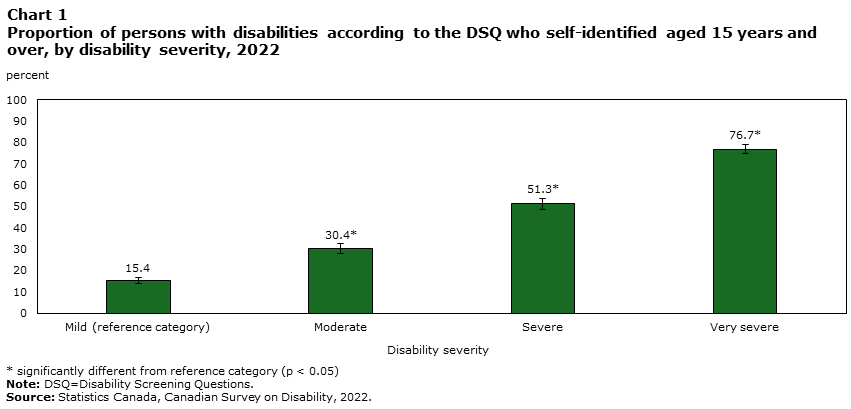
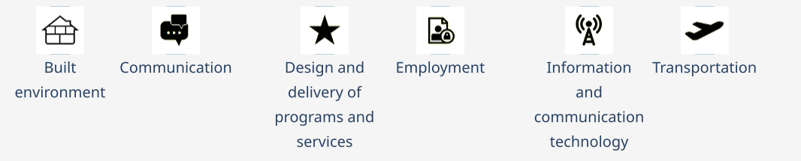
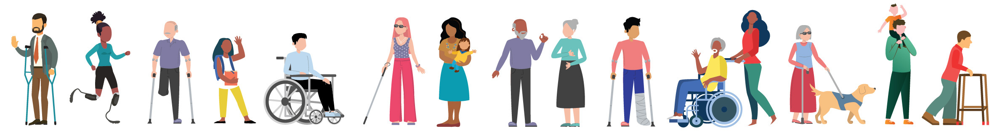
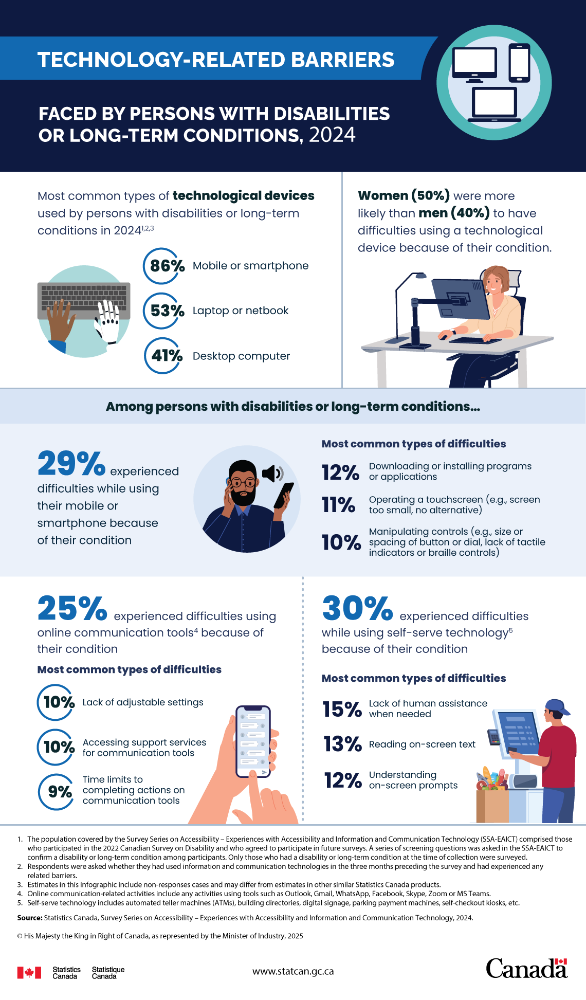
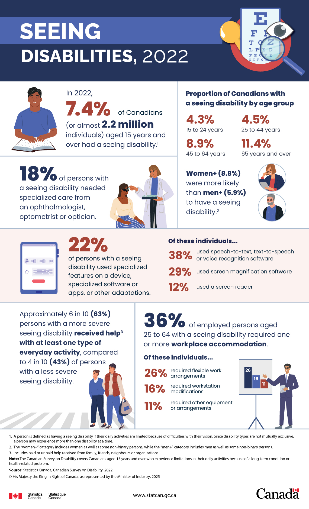
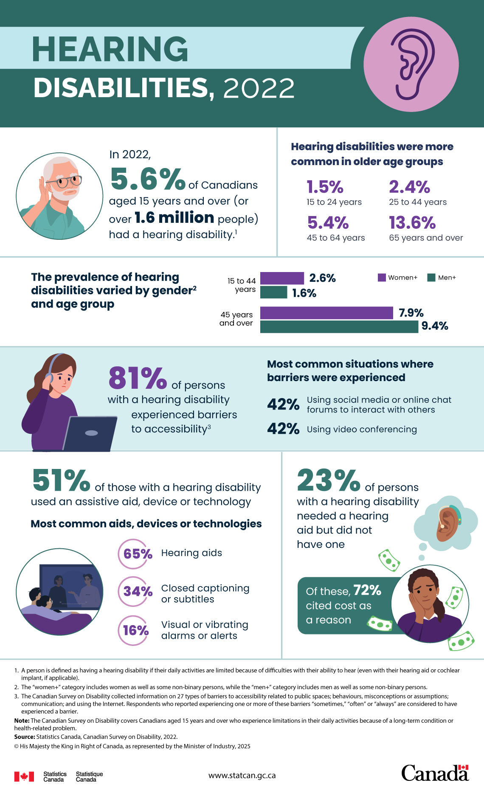
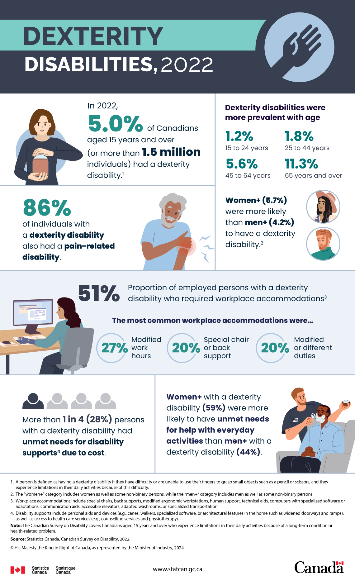

---
# Extends metadata from _quarto.yml
subtitle: "Lecture: Accessibility"
date: 2026-09-01
---



# Today's outline

- Lecture: Accessibility
  - Statistics in Canada
  - Assistive Technologies

- Ideation

## Introduction

:::: {.columns}
::: {.column width="20%"}

<small>
<!-- Defeating the Disembodiment of Design in the AI Age  -->
[ACM Interactions](https://interactions.acm.org/archive/view/september-october-2026/a-born-accessible-approach-to-technology-design) September-October 2026.
</small>
:::
::: {.column width="80%"}
<object data="images/3rdparty/ACM-Interactions-Sep-2026-Accessible-Excerpt.svg"></object>
:::
::::

## In Canada

:::: {.columns}
::: {.column width="20%"}

<small>
Carrly McDiarmid and Rebecca Choi, 
[Technical report on disability measurement in Canada](https://www150.statcan.gc.ca/n1/pub/89-654-x/89-654-x2026001-eng.htm). 
Reports on Disability and Accessibility in Canada. 
Statistics Canada. 
March 17, 2026.
</small>
:::
::: {.column width="80%"}
<small><blockquote>In 2022, the prevalence of disability in Canada among the population aged 15 years and over, using the Disability Screening Questions (DSQ), was 27.0% (8.0 million individuals). Among them, approximately **3.2 million individuals self-identified as a person with a disability**, which is almost two-fifths (38.5%) of persons with disabilities according to the DSQ and **one in ten (10.4%) of the Canadian population aged 15 years and over**. 
</blockquote>
</small>

:::
::::

## What barriers?

:::: {.columns}
::: {.column width="20%"}

<small>
[Accessibility Statistics Hub](https://www.statcan.gc.ca/en/topics-start/accessibility). 
Statistics Canada. 
</small>
:::
::: {.column width="80%"}


:::
::::



## Technology-related barriers {.scrollable}

:::: {.columns}
::: {.column width="20%"}

<small>
[Technology-related barriers faced by persons with disabilities or long-term conditions, 2024](https://www150.statcan.gc.ca/n1/pub/11-627-m/11-627-m2025029-eng.htm). 
Statistics Canada. 
March 24, 2025. 
</small>
:::
::: {.column width="80%"}



:::
::::

## Seeing disabilities {.scrollable}

:::: {.columns}
::: {.column width="20%"}

<small>
[Seeing disabilities, 2022](https://www150.statcan.gc.ca/n1/pub/11-627-m/11-627-m2025002-eng.htm). 
Statistics Canada. 
January 3, 2025. 
</small>
:::
::: {.column width="80%"}



:::
::::

## Hearing disabilities {.scrollable}

:::: {.columns}
::: {.column width="20%"}

<small>
[Hearing disabilities, 2022](https://www150.statcan.gc.ca/n1/pub/11-627-m/11-627-m2025012-eng.htm). 
Statistics Canada. 
March 3, 2025. 
</small>
:::
::: {.column width="80%"}



:::
::::

## Dexterity disabilities {.scrollable}

:::: {.columns}
::: {.column width="20%"}

<small>
[Dexterity disabilities, 2022](https://www150.statcan.gc.ca/n1/pub/11-627-m/11-627-m2024054-eng.htm). 
Statistics Canada. 
December 3, 2024. 
</small>
:::
::: {.column width="80%"}



:::
::::

## And many more disabilities!

- [Flexibility](https://www150.statcan.gc.ca/n1/pub/11-627-m/11-627-m2024055-eng.htm)
- [Mobility](https://www150.statcan.gc.ca/n1/pub/11-627-m/11-627-m2024056-eng.htm)
- [Pain-related](https://www150.statcan.gc.ca/n1/pub/11-627-m/11-627-m2024050-eng.htm)
- [Learning](https://www150.statcan.gc.ca/n1/pub/11-627-m/11-627-m2024045-eng.htm) 
- [Mental health-related](https://www150.statcan.gc.ca/n1/pub/11-627-m/11-627-m2025010-eng.htm)
- [...](https://www150.statcan.gc.ca/n1/en/type/analysis?text=11-627-M&subject_levels=13%2C1301&p=0-All#all)
- Not necessarily visible!

# Assistive Technologies



<small>
Met at Dagstuhl Seminar 23252
[Inclusive Data Visualization](https://www.dagstuhl.de/23252). 
Jun 18-23, 2023.  
</small>

## Assistive Technologies (AT) and Information Communication Technologies (ICT) 

*   **AT:** Tools and devices designed to help individuals with disabilities perform tasks and participate in daily life.
*   **ICT:** Technologies that provide access to information and communication, such as computers, internet, mobile devices, and software applications.
*   **Intersection:**  Understanding how AT and ICT intersect is crucial for creating accessible digital experiences. ICT should be compatible with and usable by various AT.



# Assistive Technologies for Visual Impairments



## Screen Readers

*   Software that converts text and interface elements into speech or braille.
*   Examples: JAWS, NVDA, VoiceOver, Orca
*   [NV Access - NVDA Screen Reader](https://www.nvaccess.org/)
*   [Freedom Scientific - JAWS Screen Reader](https://www.freedomscientific.com/training/jaws/)



## Magnification Software

*   Enlarges portions of the screen to make content easier to see.
*   Examples: ZoomText, Windows Magnifier, macOS Zoom



## Braille Displays

*   Electronic devices that display text in braille, often used with screen readers.
*   Provides tactile access to digital information.



# Assistive Technologies for Auditory Impairments



## Assistive Listening Devices (ALDs)

*   Amplify and clarify sound for individuals with hearing loss.
*   Types: Hearing aids, cochlear implants, FM systems, induction loops.
*   [National Institute on Deafness and Other Communication Disorders (NIDCD) - Assistive Devices for People with Hearing, Voice, Speech, or Language Disorders](https://www.nidcd.nih.gov/health/assistive-devices-people-hearing-voice-speech-or-language-disorders)



## Captioning and Subtitles

*   Textual representation of audio content in videos and live events.
*   Essential for accessibility of multimedia content.



# Assistive Technologies for Motor Impairments



## Switch Devices

*   Allow users to interact with technology using alternative input methods.
*   Activated by various movements: buttons, head switches, sip-and-puff.



## Eye-Gaze Systems

*   Track eye movements to control a computer cursor or other devices.
*   Enables hands-free interaction for individuals with limited mobility.
*   [Tobii Dynavox - Eye Tracking](https://us.tobiidynavox.com/pages/what-is-eye-tracking)



## Voice Control Software

*   Allows users to control computers and devices using voice commands.
*   Examples: Dragon NaturallySpeaking, Siri, Google Assistant, Alexa
*   [Nuance - Dragon Professional](https://dragon.nuance.com/en-us/dragon-professional)



# Assistive Technologies for Cognitive & Speech Impairments



## Text-to-Speech (TTS)

*   Synthesizes spoken words from digital text.
*   Benefits individuals with reading difficulties or speech impairments.
*   Often integrated into screen readers and other applications.
*   [ReadSpeaker - Text to Speech Solutions](https://www.readspeaker.com/)



## Reading Aids

*   Tools to support reading comprehension and fluency.
*   Examples:  dyslexia fonts, text highlighting, line readers, optical character recognition (OCR).



## Memory Aids

*   Devices and software to assist with memory and organization.
*   Examples:  Reminder apps, digital calendars, note-taking software, voice recorders.



# Testing with Assistive Technologies



## Why Test with AT?

*   Ensures real-world accessibility for users who rely on these tools.
*   Identifies usability issues that may not be apparent through other testing methods.
*   Validates conformance with accessibility standards.



##  Testing Methods

*   **Manual Testing:**  Involving users with disabilities who use AT to test the ICT.
*   **Automated Testing:**  Tools can check for some types of AT compatibility issues, but manual testing is crucial.
*   **Usability Testing:** Observe users with disabilities using AT to complete tasks within the ICT.



## AI testing?

> When generating code, [**LLMs have an unfortunate bias towards producing accessibility antipatterns**](https://microsoft.github.io/a11y-llm-eval-report/) since every major LLM currently available is trained on decades of inaccessible code.

<small>
[Building a general-purpose accessibility agent—and what we learned in the process - The GitHub Blog](https://github.blog/ai-and-ml/github-copilot/building-a-general-purpose-accessibility-agent-and-what-we-learned-in-the-process/). May 15, 2026.
</small>

##  Common AT for Testing

*   **Screen Readers:**  NVDA, JAWS (common for web accessibility testing)
*   **Magnification Software:**  Built-in OS magnifiers
*   **Keyboard-only Navigation:** Testing without a mouse
*   **Voice Control:** Operating systems' built-in voice control features



# AT Related Legislation



##  Examples of Legislation {.scrollable}

*   **Americans with Disabilities Act (ADA) (USA):** Mandates accessibility in various areas, including ICT in some contexts.
    *   [ADA.gov](https://www.ada.gov/)
*   **Section 508 of the Rehabilitation Act (USA):** Requires federal agencies to make their ICT accessible.
    *   [Section508.gov](https://www.section508.gov/)
*   **Accessibility for Ontarians with Disabilities Act (AODA) (Canada):**  Provincial legislation with ICT accessibility standards.
    *   [Ontario.ca - Accessibility Laws](https://www.ontario.ca/page/accessibility-laws)
*   **European Accessibility Act (EAA) (EU):**  Sets accessibility requirements for a range of products and services, including ICT.
    *   [European Commission - European Accessibility Act](https://ec.europa.eu/social/main.jsp?catId=1202)



## No legislation in Alberta yet!

[Alberta - Accessibility Services Canada](https://accessibilitycanada.ca/legislation/alberta/)

<blockquote>
Alberta does not have a provincial accessibility legislation yet, however, it does have some related legislation. For example:

-   Acts addressing specific aspects of accessibility (e.g., the _Service Dogs Act_)
-   Acts dealing with other issues but which contain clauses on how disability affects the administration of that focus (e.g., the _Student Financial Assistance Act_) 
</blockquote>

<!-- Alberta was one of the first jurisdictions in Canada to establish an advocate specifically dedicated to persons with disabilities. _[The Advocate for Persons with Disabilities Act](https://www.assembly.ab.ca/net/index.aspx?p=bills_status&selectbill=205&legl=29&session=3)_ was proclaimed into law in the spring of 2018 to allow the government to better support persons with disabilities and their families -->

##  Importance of Legislation

*   Provides legal frameworks to ensure accessibility.
*   Drives development and procurement of accessible ICT and AT.
*   Promotes inclusivity and equal access for people with disabilities.



## Further Resources

*   **Web Accessibility Initiative (WAI):** [https://www.w3.org/WAI/](https://www.w3.org/WAI/)
*   **Assistive Technology Industry Association (ATIA):** [https://www.atia.org/](https://www.atia.org/)



# Conclusion

Your knowledge on multiple modalities gained through this course may become helpful for people with accessibility needs!

# A personal example

## LivePose Portal


```{=html}
<iframe width="100%" height="100%" src="https://sat-mtl.gitlab.io/metalab/presentations/2023-LivePosePortal-MozillaResponsibleAI/"></iframe>
```

# Next steps {.scrollable}

::::: columns
::: {.column width="50%"}
Develop
<small>

Is your personal GitHub repository ready?

- **Create** a [GitHub](https://github.com/) account.
- **Share** it with [ChristianFrisson](https://github.com/ChristianFrisson) by following his account.
- [ChristianFrisson](https://github.com/ChristianFrisson) will create a [new GitHub repository](https://github.com/new) in [ucalgary-cmd](https://github.com/ucalgary-cmd) for your individual interactive presentations and pitch:
  - Name: `CPSC599-601-CreativeComputing-F26-<username>`
  - Visibility: first private, then your choice to make it public.
  - License: your choice (tip: [choosealicense.com](https://choosealicense.com/)).
- [ChristianFrisson](https//github.com/ChristianFrisson) will invite you to join your repository as admin.

</small>
:::
::: {.column width="50%"}
Design

<small>

How **accessible** should what you would like to create in this course be?

- **Sketch** your design(s).
- **Snap** a picture.
- **Upload** your picture in your GitHub repository.

</small>
:::
:::::

