---
# Extends metadata from _quarto.yml
subtitle: "Lecture: Creative Computing"
date: 2026-09-01
---

# Today's outline

- Introduction
- Communication
- Installation

# Introduction

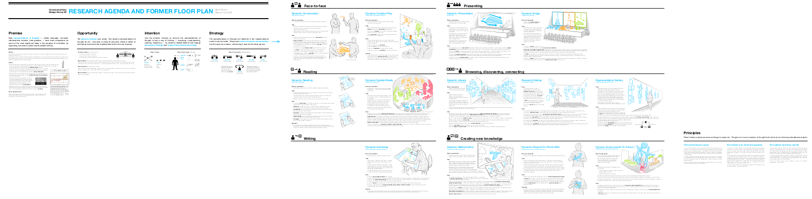

<small> Bret Victor's [Research Agenda](https://worrydream.com/cdg/ResearchAgenda-v0.19-poster.pdf), Communications Design Group SF, 2014. </small>

## Modes of Representation of Concepts

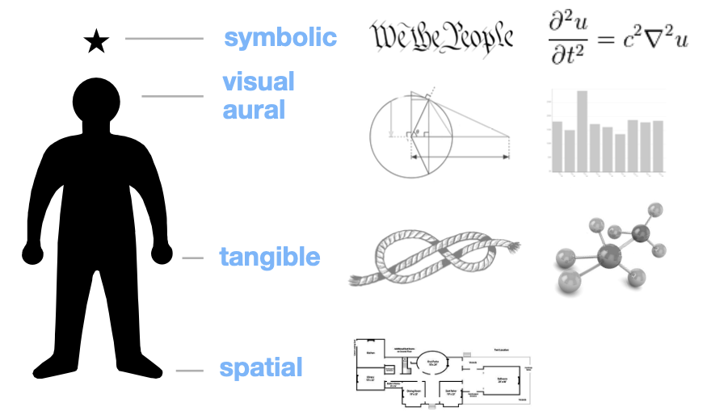

## Modes of Communication of Representations

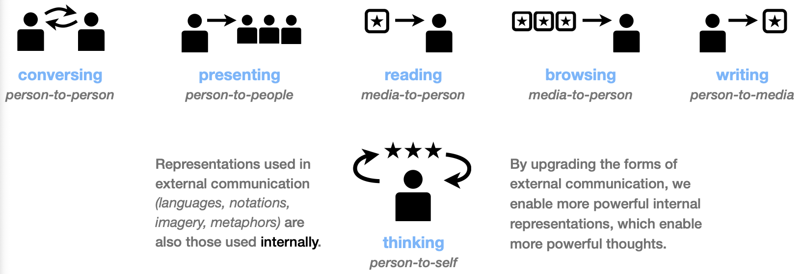

## Communication Framework

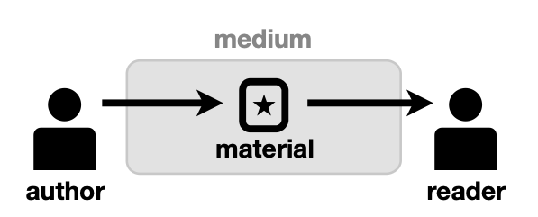

## Modes of Communication

::::: columns
::: {.column width="50%"}
{.logo} Face-to-face

{.logo} Reading

{.logo} Writing
:::

::: {.column width="50%"}
{.logo} Presenting

{.logo} Browsing, discovering, connecting

{.logo} Creating new knowledge
:::
:::::

## Projects

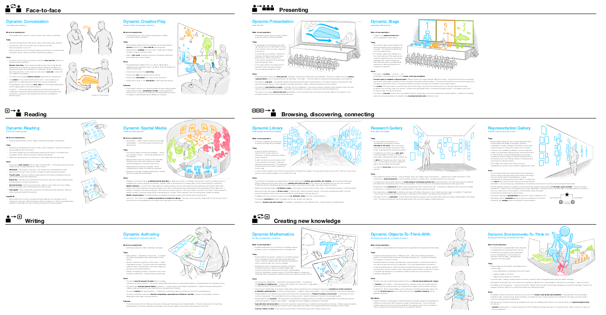

## Mode of Communication <br/> {.logo} Face-to-face

## {.logo} Dynamic Conversation

:::: r-hstack
::: desc
<ul>

<li><b>Mode of communication:</b><small>person-to-person, face-to-face, realtime, improvised</small></li>

<li><b>Today:</b><br/><small>picture in the head</small></li>

<li><b>Vision:</b><small>dynamic sketching for evidence-backed show and tell</small></li>

</ul>
:::

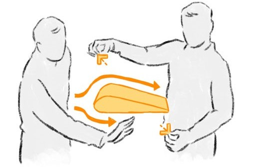{width="100%"} 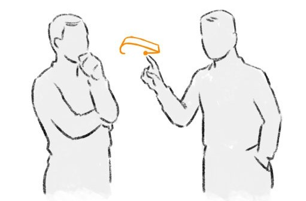{width="100%"}
::::

## {.logo} Dynamic Creative Play

:::: r-hstack
::: desc
<ul>

<li><b>Mode of communication:</b><small>casual, playful, realtime, improvised, shared experience</small></li>

<li><b>Today:</b><small>passive, non-creative, isolating, anti-social</small></li>

<li><b>Vision:</b><small>everyone participates/sees/understands the same thing</small></li>

</ul>
:::

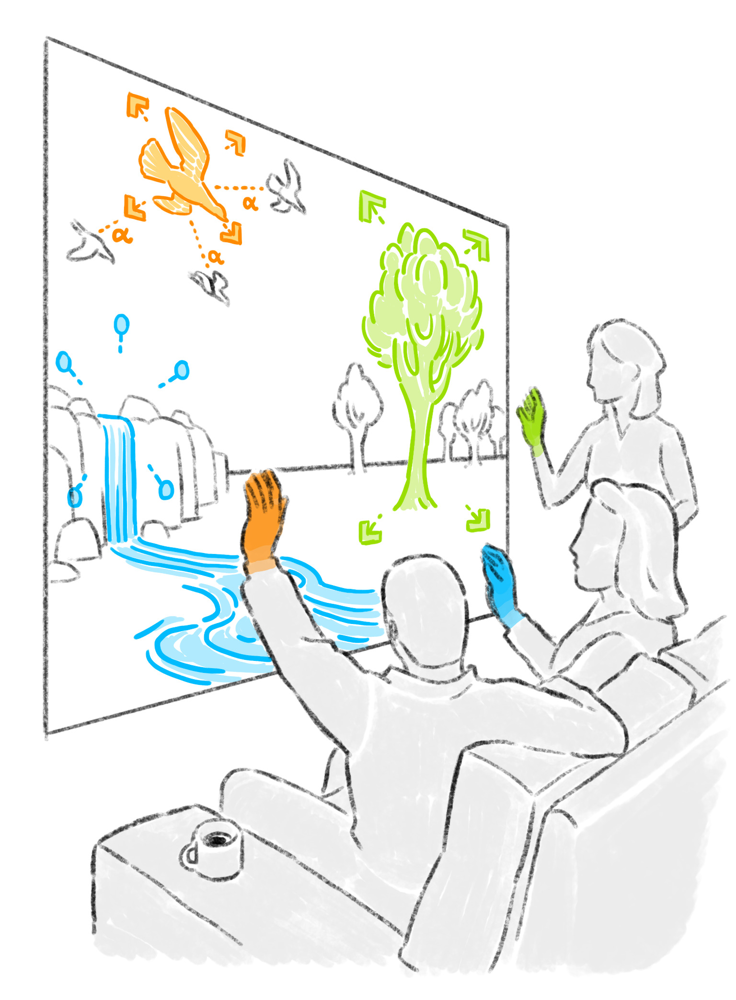{width="80%"}
::::

## Mode of Communication <br/> {.logo} Presenting

## {.logo} Dynamic Presentation

:::: r-hstack
::: desc
<ul>

<li><b>Mode of communication:</b><small>person-to-group, realtime, prepared outline but improvised details</small></li>

<li><b>Today:</b><small>flexible blackboard or scripted static slides</small></li>

<li><b>Vision:</b><small>sketch from scratch evidence-backed dynamic representations</small></li>

</ul>
:::

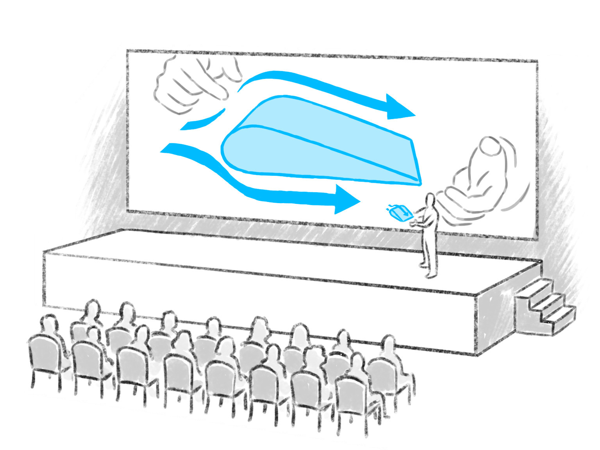{width="100%"}
::::

## {.logo} Dynamic Stage

:::: r-hstack
::: desc
<ul>

<li><b>Mode of communication:</b><small>spatial environment in which a presentation takes place</small></li>

<li><b>Today:</b><small>presentation material without stage design vs play and set</small></li>

<li><b>Vision:</b><small>mapping between concept/physical spaces, human-scale representations, layout is outline</small></li>

</ul>
:::

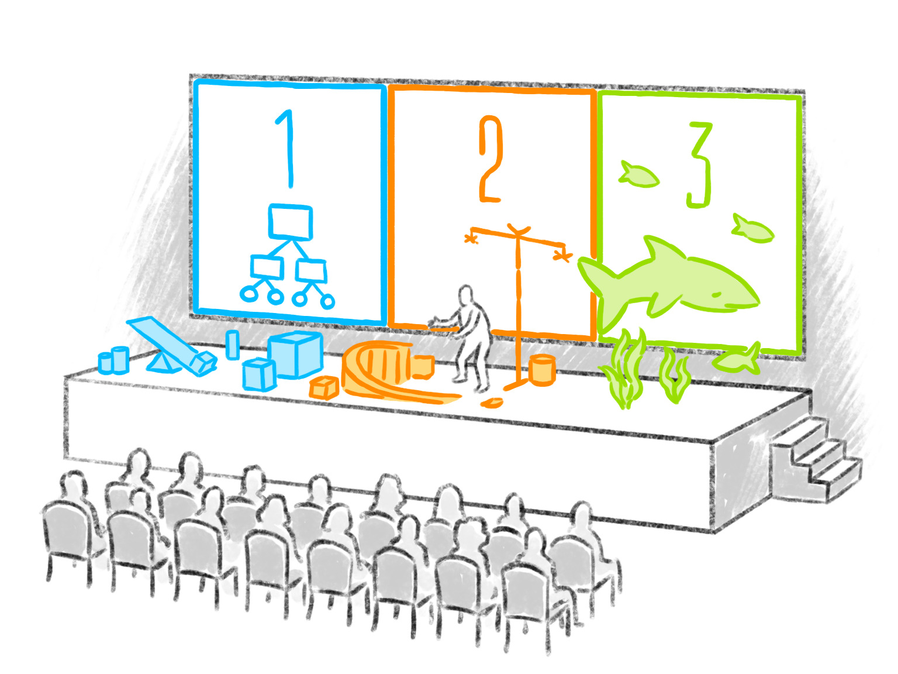{width="100%"}
::::

## Mode of Communication <br/> {.logo} Reading

## {.logo} Dynamic Reading

:::: r-hstack
::: desc
<ul>

<li><b>Mode of communication:</b><small>media-to-person, solitary, deliberate, prolonged, contemplative</small></li>

<li><b>Today:</b><small>concepts represented with words, mass-produced, one-size-fits-all</small></li>

<li><b>Vision:</b><small>multi-channel, skimmable, transformable, explorable, context-sensitive, interrogable</small></li>

</ul>
:::

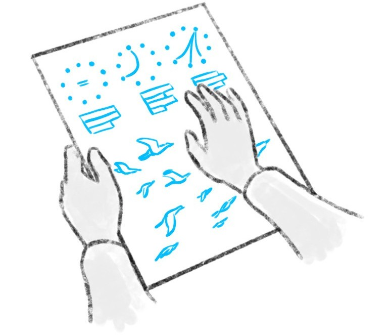{width="40%"} 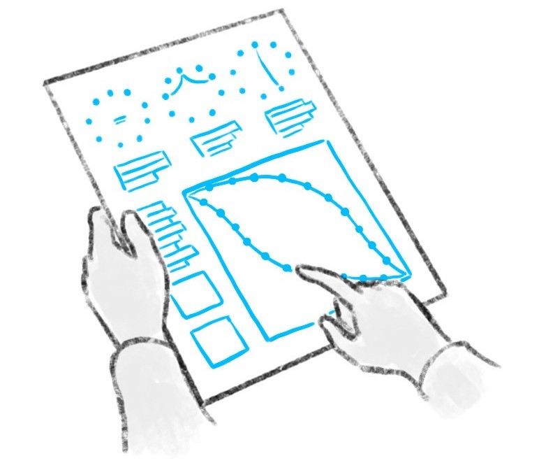{width="40%"} 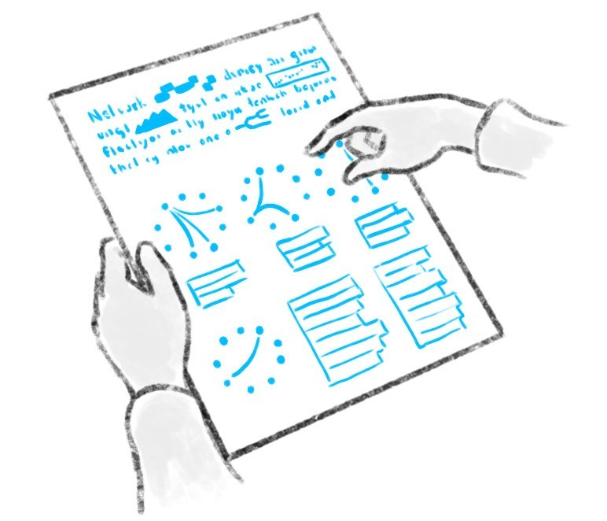{width="40%"}
::::

## {.logo} Dynamic Spatial Media

:::: r-hstack
::: desc
<ul>

<li><b>Mode of communication:</b><small>media-to-person, personal,prolonged, contemplative — but human-scale, and experienced with the body</small></li>

<li><b>Today:</b><small>rectangular representations, focal vision, flat, intangible, hands neglected</small></li>

<li><b>Vision:</b><small>Spatial textbooks, published and downloaded</small></li>

</ul>
:::

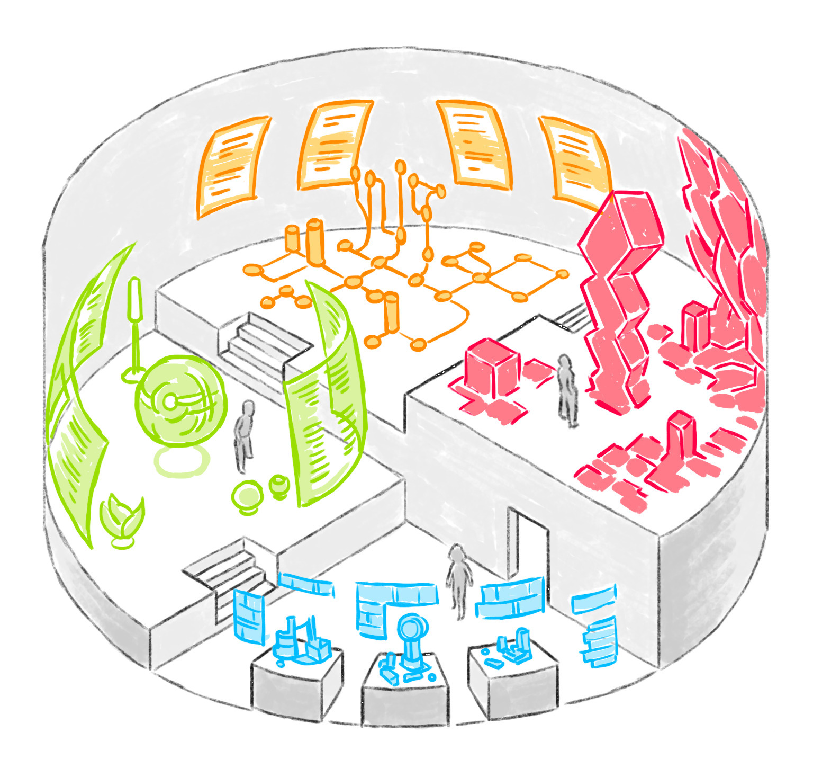{width="100%"}
::::

## Mode of Communication <br/> {.logo} Browsing, discovering, connecting

## {.logo} Dynamic Library

:::: r-hstack
::: desc
<ul>

<li><b>Mode of communication:</b><small>walkable environment for browsing and discovering knowledge</small></li>

<li><b>Today:</b><small>layouts of shelves of spines and books of papers conveying poor information</small></li>

<li><b>Vision:</b><small>dynamic, multi-channel, at all time/distance scales, with spatially-anchored overview and connections</small></li>

</ul>
:::

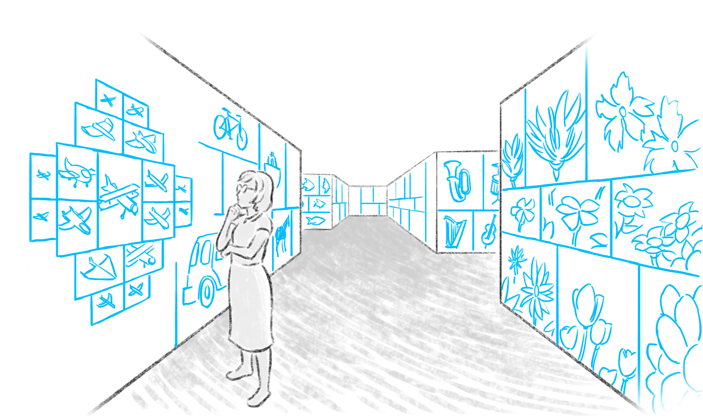{width="100%"}
::::

## {.logo} Research Gallery

:::: r-hstack
::: desc
<ul>

<!-- <li><b>Mode of communication:</b><small></small></li> -->

<li><b>Today:</b><small>prior work displayed in space, less to learn than website/papers</small></li>

<li><b>Vision:</b><small>intellectual environnment, physical presence, immersed, connections, space is a form of publication</small></li>

</ul>
:::

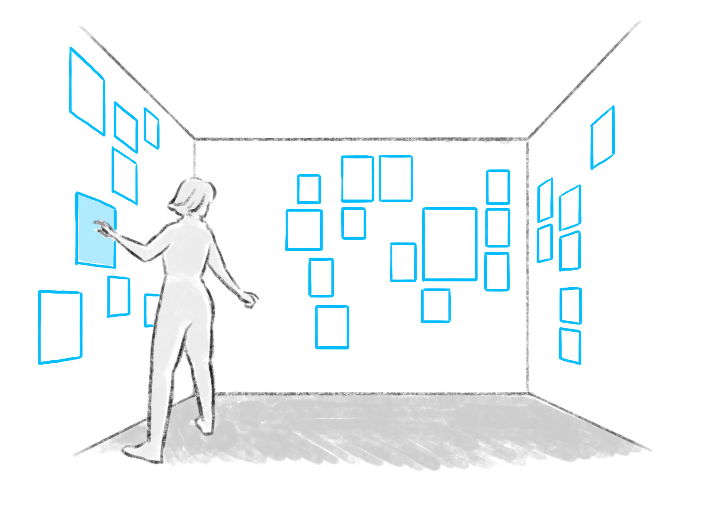{width="100%"}
::::

## {.logo} Representation Gallery

:::: r-hstack
::: desc
<ul>

<!-- <li><b>Mode of communication:</b><small></small></li> -->

<li><b>Today:</b><small>design of visualization and programming languages, but not of representations</small></li>

<li><b>Vision:</b><small>dynamic representations, for generalization/instantiation/analogy on corpus of ideas</small></li>

</ul>
:::

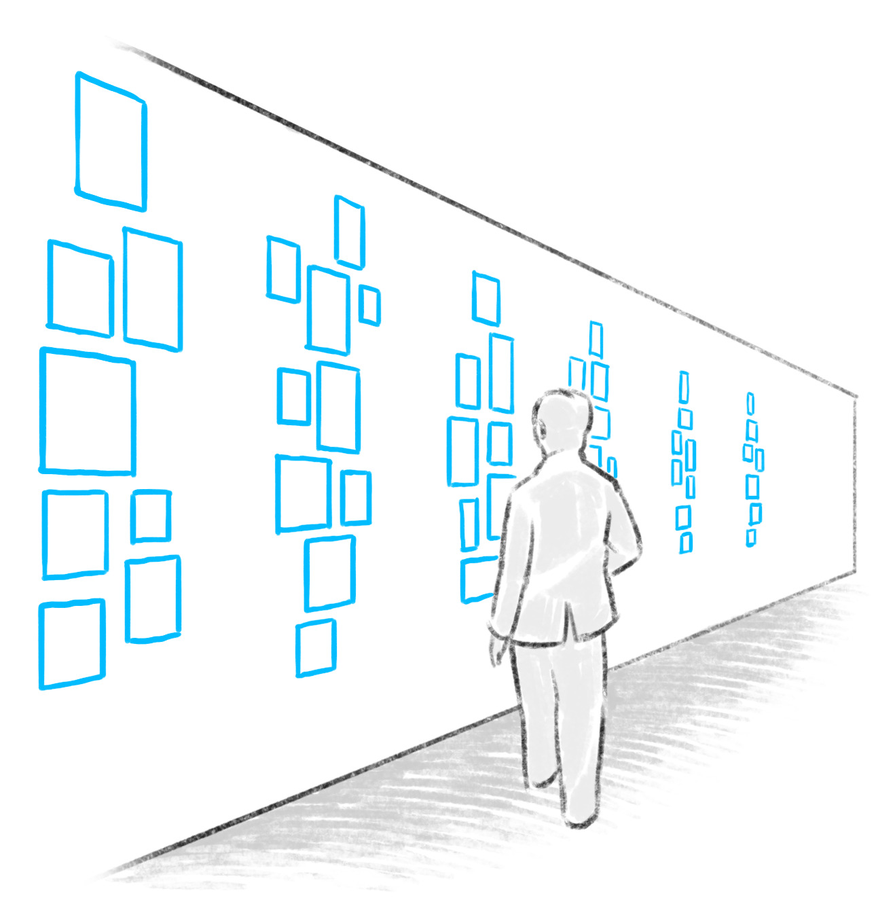{width="100%"}
::::

## Mode of Communication <br/> {.logo} Writing

## {.logo} Dynamic Authoring

:::: r-hstack
::: desc
<ul>

<li><b>Mode of communication:</b><small>person-to-media, deliberate, prolonged</small></li>

<li><b>Today:</b><small>materials are static/manipulated or dynamic/scripted</small></li>

<li><b>Vision:</b><small>directly manipulate representations of behavior and data</small></li>

</ul>
:::

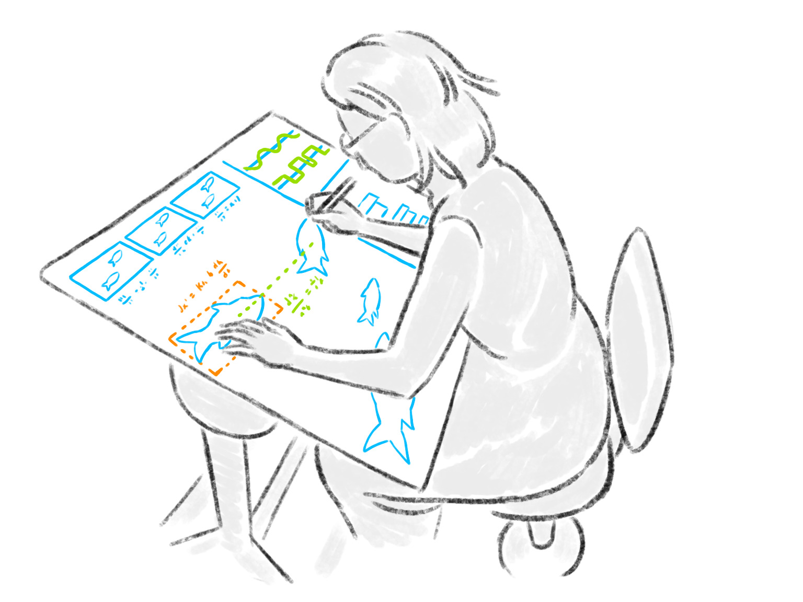{width="100%"}
::::

## Mode of Communication <br/> {.logo} Creating new knowledge

## {.logo} Dynamic Mathematics

:::: r-hstack
::: desc
<ul>

<li><b>Mode of communication:</b><small>set of tools for modeling physical systems, in order to understand, predict, and design them</small></li>

<li><b>Today:</b><small>opaque representations, blind manipulation</small></li>

<li><b>Vision:</b><small>evocative multimodal representations</small></li>

</ul>
:::

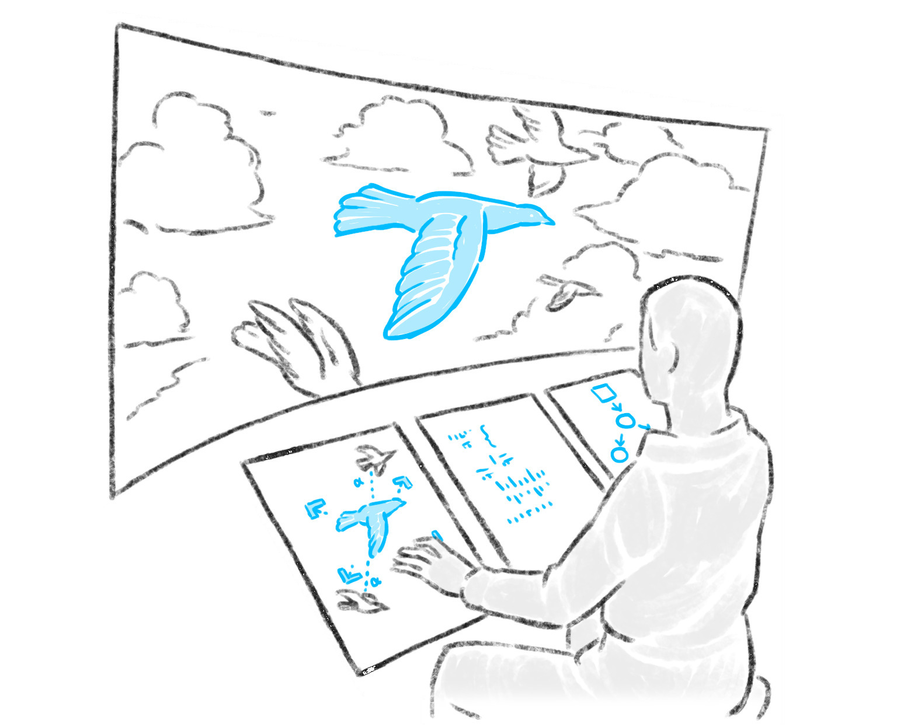{width="100%"}
::::

## {.logo} Dynamic Objects To Think With

:::: r-hstack
::: desc
<ul>

<li><b>Mode of communication:</b><small>representation that’s designed to be inspected and manipulated with the hands</small></li>

<li><b>Today:</b><small>flat and intangible, ink on paper or pixels on a screen</small></li>

<li><b>Vision:</b><small>dynamic abstract/symbolic concepts felt and manipulated by the fingers</small></li>

</ul>
:::

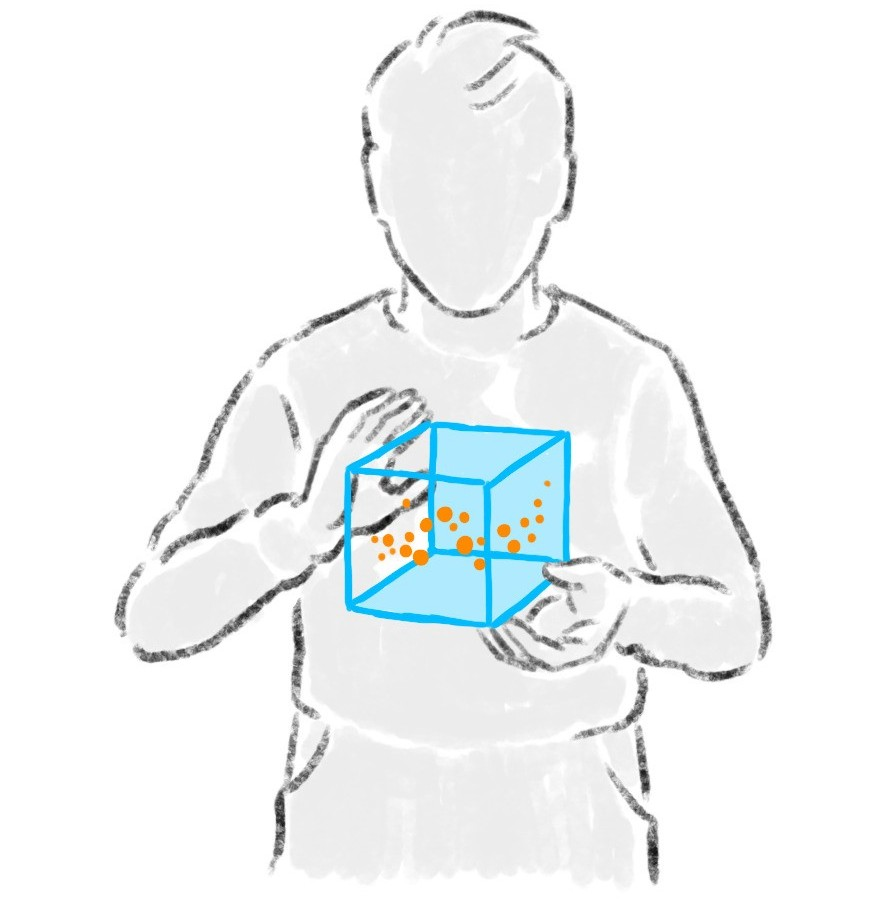{width="50%"} 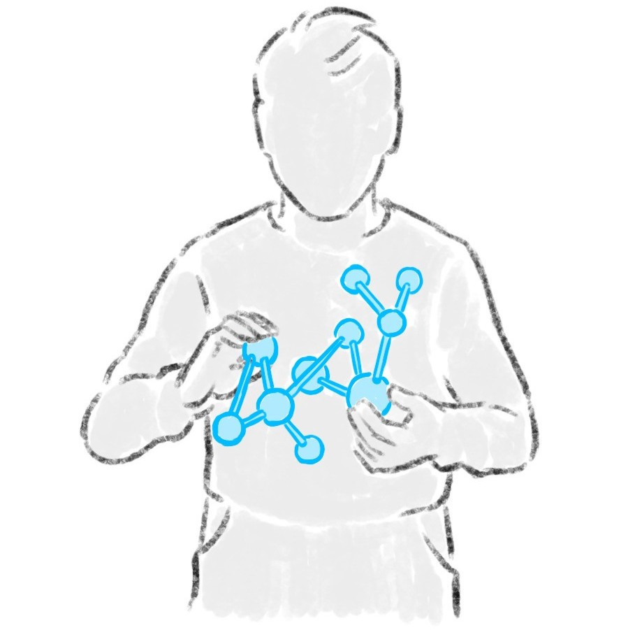{width="50%"}
::::

## {.logo} Dynamic Environments To Think With

:::: r-hstack
::: desc
<ul>

<li><b>Mode of communication:</b><small>representation that’s designed to be explored and manipulated with the body</small></li>

<li><b>Today:</b><small>static design environments, paper or screens, immobile</small></li>

<li><b>Vision:</b><small>human-scale spatial representations, physical tangible tools</small></li>

</ul>
:::

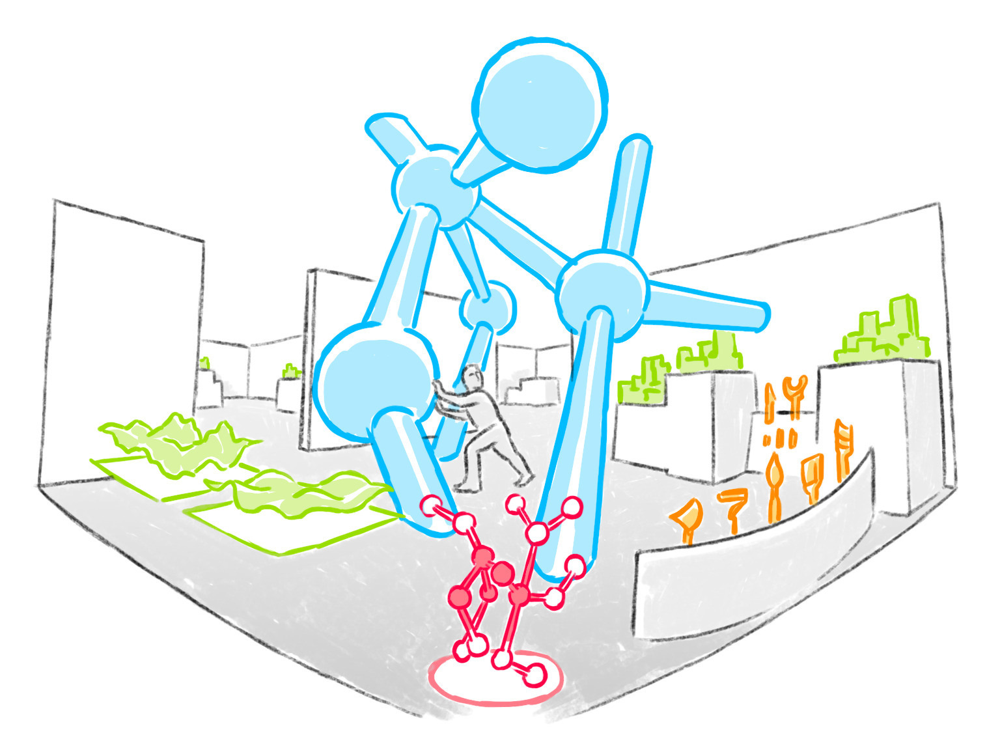{width="100%"}
::::

## Modes of Communication of Representations (Repeat)


## More information


- <https://worrydream.com>
- <https://dynamicland.org>

# Communication


- Collaboration
- Inspiration
- Creation
- Documentation
- Presentation

## Explorable Explanations

```{=html}
<iframe width="100%" height="100%" src="https://explorabl.es/"></iframe>
```

## Our toolchain

- [Visual Studio Code](https://code.visualstudio.com/) or [VSCodium](https://vscodium.com/) plus extensions:
  - [Quarto](https://github.com/quarto-dev/quarto.git#main): to create **Interactive Presentations** and **Pitches** ([revealjs](https://revealjs.com)) from Markdown.
  - [C/C++](https://github.com/microsoft/vscode-cpptools) PLUS [extra compiler installation](https://github.com/microsoft/vscode-cpptools#overview-and-tutorials) needed for the ([*Touch*](lecture-touch.html): Haptics) **Studio**.
  - [LTeX+](https://github.com/ltex-plus/vscode-ltex-plus.git): grammar/spell checking using LanguageTool.
- Git, [GitHub](https://github.com/) (Pages)

## About Quarto

```{=html}
<iframe width="100%" height="100%" src="https://quarto.org/"></iframe>
```

## Need tutorials on git?

```{=html}
<iframe width="100%" height="100%" src="https://www.youtube.com/embed/videoseries?si=QLhK4wVwOGT_oUF6&amp;list=PLWuPyCyP7tT8" title="YouTube video player" frameborder="0" allow="accelerometer; autoplay; clipboard-write; encrypted-media; gyroscope; picture-in-picture; web-share" referrerpolicy="strict-origin-when-cross-origin" allowfullscreen></iframe>
```

# Next steps

::::: columns
::: {.column width="50%"}
Develop

<small>

- **Create** a [GitHub](https://github.com/) account.
- **Share** it with [ChristianFrisson](https://github.com/ChristianFrisson) by following his account.
- [ChristianFrisson](https://github.com/ChristianFrisson) will create a [new GitHub repository](https://github.com/new) in [ucalgary-cmd](https://github.com/ucalgary-cmd) for your individual interactive presentations and pitch:
  - Name: `CPSC599-601-CreativeComputing-F26-<name>`
  - Visibility: first private, then your choice to make it public.
  - License: your choice (tip: [choosealicense.com](https://choosealicense.com/)).
- [ChristianFrisson](https//github.com/ChristianFrisson) will invite you to join your repository as admin.

</small>
:::

::: {.column width="50%"}
Design

<small>

, 
Morgan Kaufmann Press.
](images/3rdparty/sketchbook-cover-medium.jpg){width="40%"}

- **Sketch** what you would like to create in this course!
- **Snap** a picture.
- **Upload** your picture in your GitHub repository.

</small>
:::
:::::