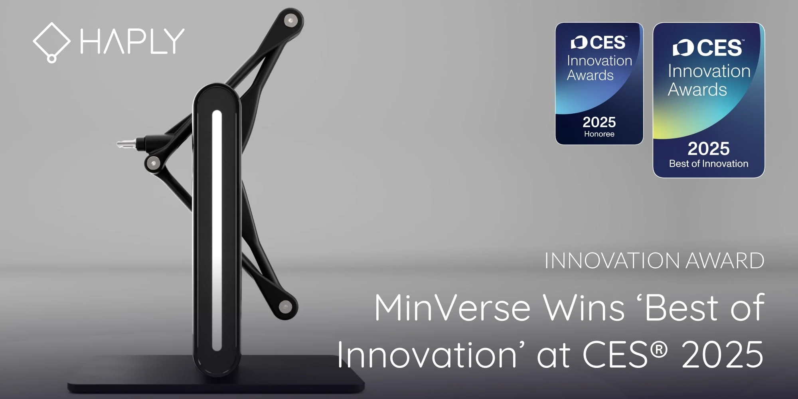
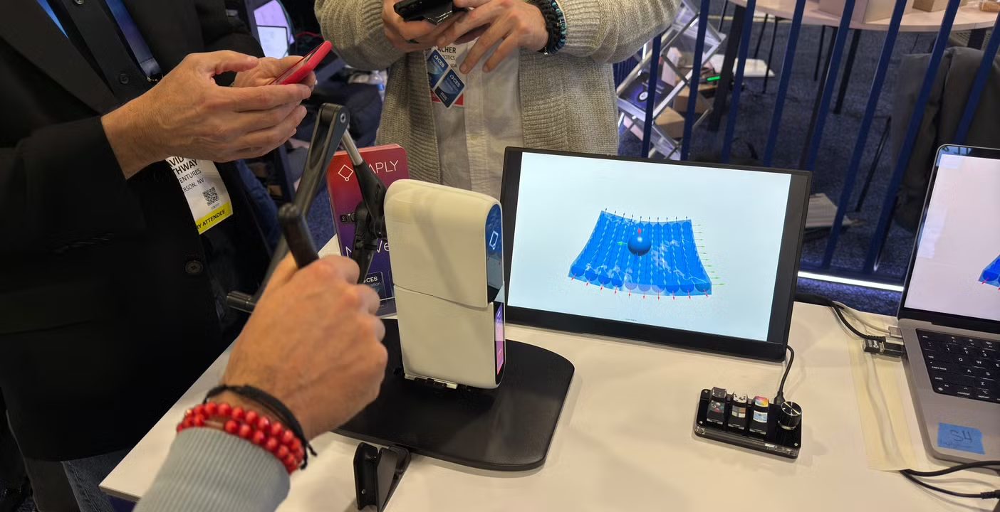
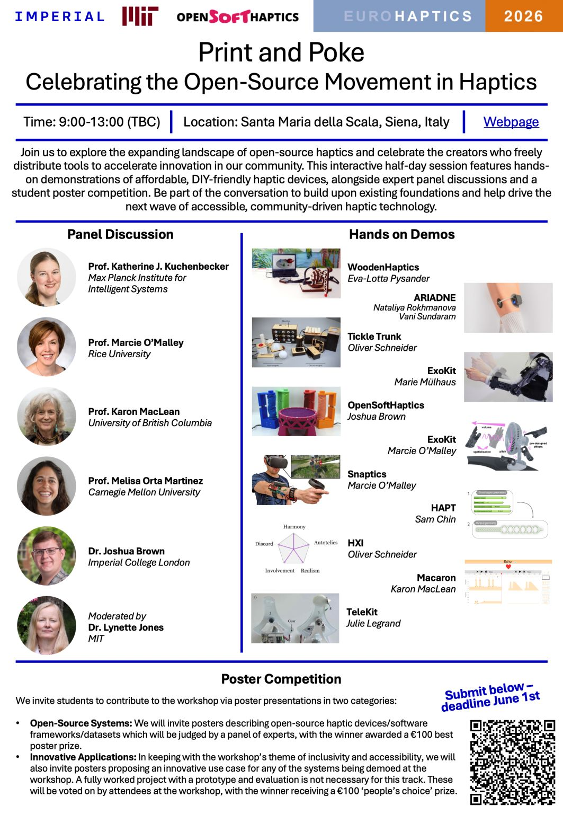
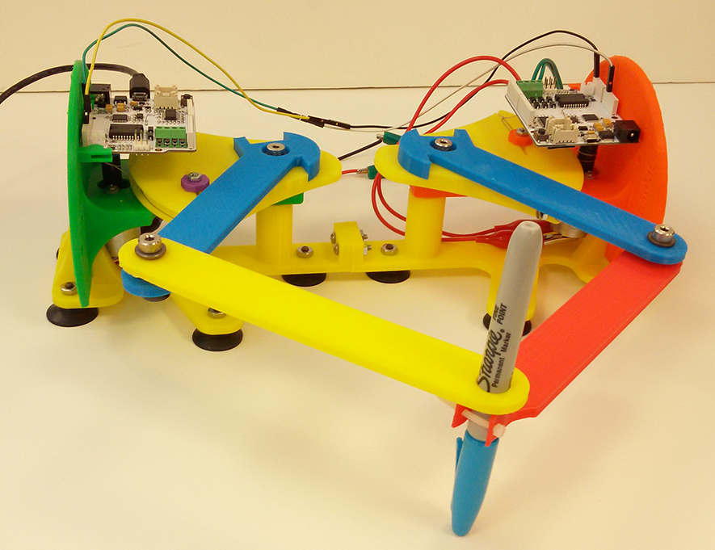
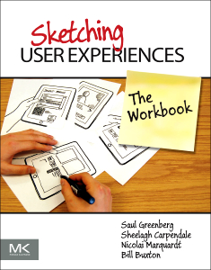
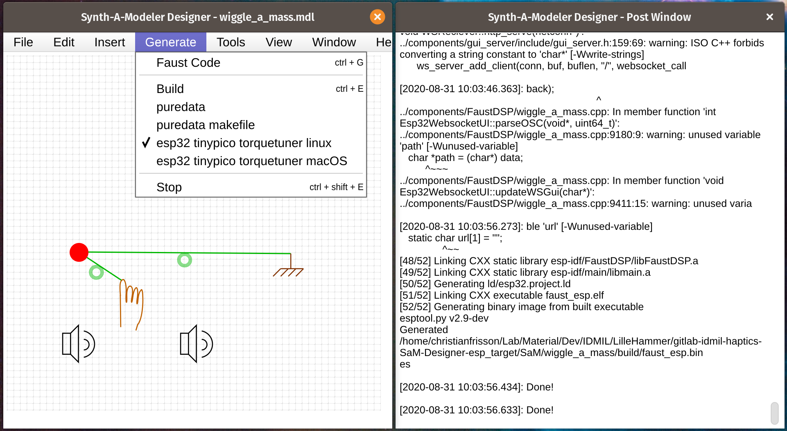
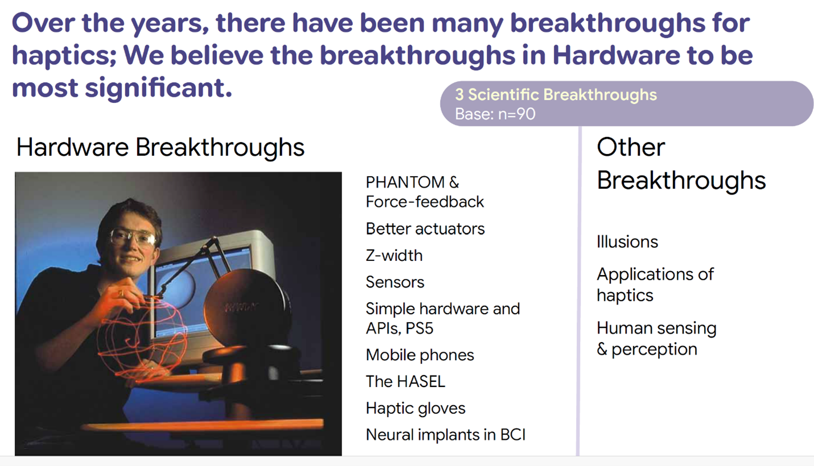
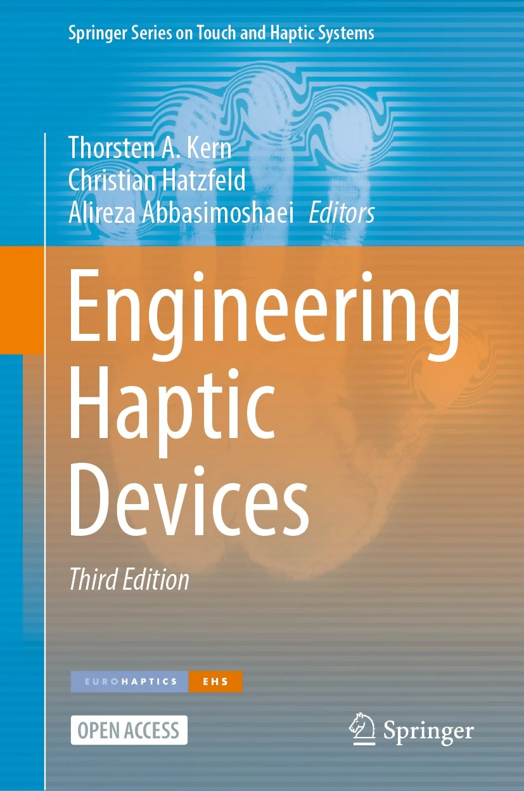
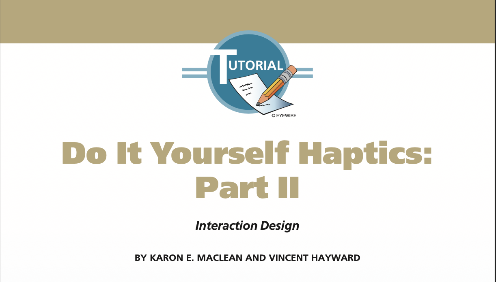
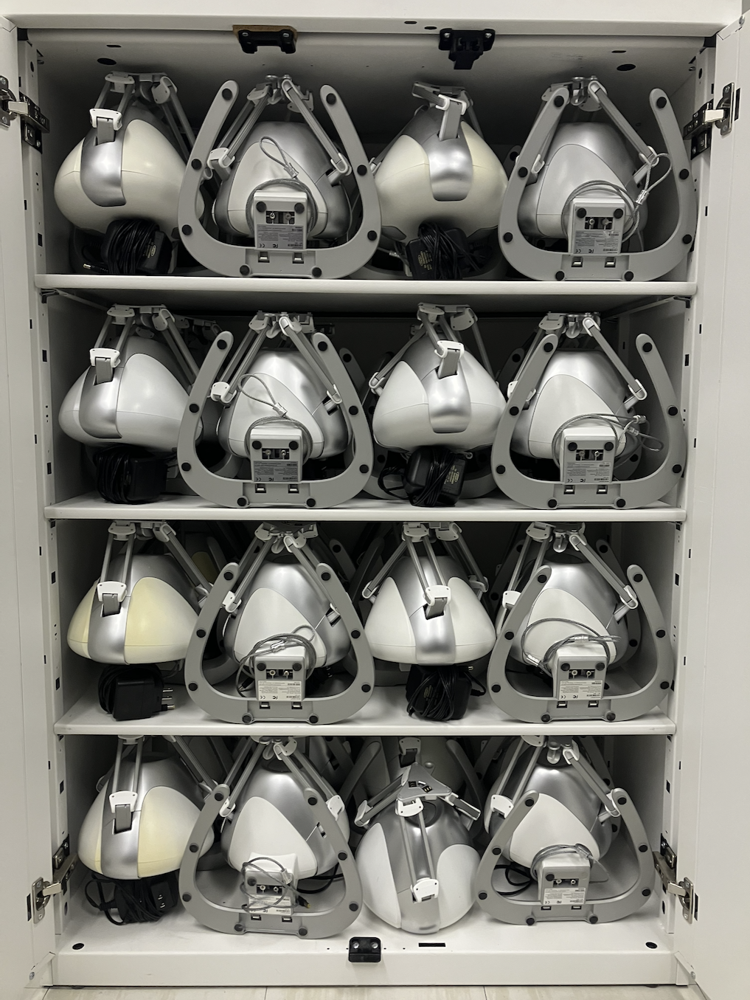

---
# Extends metadata from _quarto.yml
subtitle: "Lecture: Touch (Haptics)"
date: 2026-10-01
---



# Today's outline

- Lecture: Introduction to Touch (Haptics)
- Studio: Hack an interactive haptic artifact

# Lecture

Introduction to Touch (Haptics)

## Did you know? 

That [Haply](https://www.haply.co/discover/remote-controlled-robot-arm-with-feedback-haply-booth-ces-2025-64), a Canadian company, won the "Best of Innovation" award at [CES](https://en.wikipedia.org/wiki/CES_(trade_show)) 2025?
 
## Have you ever worked with these devices?



## Let's take a look at their CES 2025 booth

[Haply MinVerse and Inverse3: Revolutionizing Precision in 3D Navigation and Interaction | Haply Robotics](https://www.haply.co/discover/haply-minverse-and-inverse-3-goodbye-2d-mouse-the-future-is-3d-for-certain-uses)

How do we get there?

## First a (multimodal) detour



(Highlight on [RecoilString](https://github.com/mi-creative/miPhysics_Processing/tree/master/examples/3_Haptics/RecoilString))

## Learning Outcomes

- Dealing with haptic hardware
- Exploring conceptual design for haptics
- Programming for multiple senses
- Applying user evaluation methods to haptics

## Related courses

- Sonny Chan's [CPSC 599.86 & 601.86 - Winter 2019](https://web.archive.org/web/20211209040738/http://pages.cpsc.ucalgary.ca/~sonny.chan/cpsc599.86/schedule/)
- Allison Okamura's [Introduction to Haptics | Stanford Online](https://online.stanford.edu/courses/soe-yhapatics-introduction-haptics) and [ME 20N: Haptics: Engineering Touch](https://web.stanford.edu/class/me20n/)

## What senses do haptics stimulate?

, 2016
](images/3rdparty/HapticFeltAttributes.png)

## What devices provide haptic feedback?

 (Microsoft Research)'s [photograph](https://twitter.com/twi_mar/status/1202351069667323905) of a slide of the presentation from Nick Colonnese (Facebook) at the [Smart Haptics](https://www.smart-haptics.com) conference, 2019
](images/3rdparty/NickColonnese-Twitter-SHapticsConf-EK-b6BEUEAAUwlp.jpeg)

## Who needs haptics? 

<iframe width="560" height="315" src="https://www.youtube.com/embed/ZrjHURQiffA?start=11" frameborder="0" allow="accelerometer; autoplay; encrypted-media; gyroscope; picture-in-picture" allowfullscreen></iframe>

<a href="https://www.youtube.com/embed/ZrjHURQiffA?start=11">Unnatural selection: Survival in the digital age | Sile O'Modhrain | TEDxLondonBusinessSchool</a>

# How to...

## How to...

Seifi, Hasti, Matthew Chun, Colin Gallacher, Oliver Stirling Schneider, and Karon E. MacLean. “<a href="https://doi.org/10.1109/TOH.2020.2968903">How Do Novice Hapticians Design? A Case Study in Creating Haptic Learning Environments.</a>” IEEE Transactions on Haptics, 2020, 1–1.

# How to experience

Seifi, Hasti, Matthew Chun, Colin Gallacher, Oliver Stirling Schneider, and Karon E. MacLean. “<a href="https://doi.org/10.1109/TOH.2020.2968903">How Do Novice Hapticians Design? A Case Study in Creating Haptic Learning Environments.</a>” IEEE Transactions on Haptics, 2020, 1–1.

## Haptics are hard to experience online!

<iframe width="560" height="315" src="https://www.youtube.com/embed/W7qcxTXOJwA" frameborder="0" allow="accelerometer; autoplay; encrypted-media; gyroscope; picture-in-picture" allowfullscreen></iframe>

Amberg, Michel, Frédéric Giraud, Betty Semail, Paolo Olivo, Géry Casiez, and Nicolas Roussel. “<a href="https://doi.org/10.1145/2046396.2046401">STIMTAC: A Tactile Input Device with Programmable Friction.</a>” In Proceedings of the 24th Annual ACM Symposium Adjunct on User Interface Software and Technology, 7–8. UIST ’11 Adjunct. ACM, 2011.

## Online haptics via audio proxy

<iframe width="560" height="315" src="https://webaudiohaptics.github.io/#/" frameborder="0" allow="accelerometer; autoplay; encrypted-media; gyroscope; picture-in-picture" allowfullscreen></iframe>

Frisson et al., "<a href="https://webaudiohaptics.github.io/#/">WebAudioHaptics</a>", Web Audio Conference 2015

## Online haptics via audio proxy

<iframe width="560" height="315" src="https://webaudiohaptics.github.io/#/6/6" frameborder="0" allow="accelerometer; autoplay; encrypted-media; gyroscope; picture-in-picture" allowfullscreen></iframe>

Frisson et al., "<a href="https://webaudiohaptics.github.io/#/">WebAudioHaptics</a>", Web Audio Conference 2015

## Explore devices in [Haptipedia](https://haptipedia.org)

Seifi, Hasti, Farimah Fazlollahi, Michael Oppermann, John Andrew Sastrillo, Jessica Ip, Ashutosh Agrawal, Gunhyuk Park, Katherine J. Kuchenbecker, and Karon E. MacLean. “<a href="https://doi.org/10.1145/3290605.3300788">Haptipedia: Accelerating Haptic Device experiencey to Support Interaction & Engineering Design.</a>” In Proceedings of the 2019 CHI Conference on Human Factors in Computing Systems. CHI. ACM, 2019.

## Find devices in labs nearby ([IDMIL](https://www.idmil.org)) {background="images/projects/2020-03-05-IDMIL-Haptic-Showroom.jpg"}
## Find devices in labs nearby ([SHIVERS](https://ilab.ucalgary.ca/labs/shivers)) {background="images/projects/2026-03-26-ShiversDisplayCase.jpg"}

## Find open-source devices ([EH'26 P&P](https://www.super-lab.org/EH-2026-workshop))

## Build your own DIY low-cost devices

:::: {.columns}
::: {.column width="50%"}

<a href="https://github.com/idmil/TorqueTuner">IDMIL TorqueTuner</a>

:::
::: {.column width="50%"}

<a href="http://hapkit.stanford.edu/twoDOF.html">Stanford HapKit GraphKit</a>

:::
::::

# How to design

Seifi, Hasti, Matthew Chun, Colin Gallacher, Oliver Stirling Schneider, and Karon E. MacLean. “<a href="https://doi.org/10.1109/TOH.2020.2968903">How Do Novice Hapticians Design? A Case Study in Creating Haptic Learning Environments.</a>” IEEE Transactions on Haptics, 2020, 1–1.

## Use sketching techniques

<a href="http://sketchbook.cpsc.ucalgary.ca">http://sketchbook.cpsc.ucalgary.ca</a>  

## Use home/office supplies (Low-Fidelity)

Panëels, Sabrina A., Panagiotis D. Ritsos, Peter J. Rodgers, and Jonathan C. Roberts. “<a href="https://doi.org/10.1016/j.cag.2013.01.009">Prototyping 3D Haptic Data Visualizations.</a>” Computers & Graphics 37, no. 3 (May 1, 2013): 179–92.

## Use off-the-shelf devices (High-Fidelity)

<iframe width="560" height="315" src="https://www.youtube.com/embed/C-Au3ZQgmRM" frameborder="0" allow="accelerometer; autoplay; encrypted-media; gyroscope; picture-in-picture" allowfullscreen></iframe>

Frisson, Christian, and Bruno Dumas. “<a href="https://doi.org/10.1145/2839462.2856545">InfoPhys: Direct Manipulation of Information Visualisation Through a Force Feedback Pointing Device.</a>” In Proceedings of the TEI ’16: Tenth International Conference on Tangible, Embedded, and Embodied Interaction. TEI ’16. ACM, 2016.

# How to develop

Seifi, Hasti, Matthew Chun, Colin Gallacher, Oliver Stirling Schneider, and Karon E. MacLean. “<a href="https://doi.org/10.1109/TOH.2020.2968903">How Do Novice Hapticians Design? A Case Study in Creating Haptic Learning Environments.</a>” IEEE Transactions on Haptics, 2020, 1–1.

## What tools do Hapticians use?

Schneider, Oliver, Karon MacLean, Colin Swindells, and Kellogg Booth. “<a href="https://doi.org/10.1016/j.ijhcs.2017.04.004">Haptic Experience Design: What Hapticians Do and Where They Need Help.</a>” International Journal of Human-Computer Studies, Multisensory Human-Computer Interaction, 107 (November 1, 2017): 5–21.

## Framework: [Chai3d](https://chai3d.org) (force feedback)

## Tool: [Feelix](https://feelix.xyz/) (force feedback)



Anke van Oosterhout, Serhat Demirtaş, Jamie Paik, and Miguel Bruns. 
<a href="https://www.youtube.com/watch?v=vWVcES4RZdw">Feelix: A Haptic Design Tool for Rigid and Soft Actuation Systems with Machine Learning Support.</a>
World Haptics 2023 Hands-on demo

## Tool: [Meta Haptics Studio](https://developers.meta.com/horizon/resources/haptics-studio/) (vibrotactile)



## Tool: [Synth-a-Modeler Designer](https://github.com/ptrv/SaM-Designer) (force feedback)

Berdahl, Edgar, Andrew Pfalz, and Michael Blandino. “Hybrid Virtual Modeling for Multisensory Interaction Design.” In Proceedings of the Audio Mostly 2016, 215–221. AM ’16. ACM, 2016. https://doi.org/10.1145/2986416.2986451.

# How to evaluate

Seifi, Hasti, Matthew Chun, Colin Gallacher, Oliver Stirling Schneider, and Karon E. MacLean. “<a href="https://doi.org/10.1109/TOH.2020.2968903">How Do Novice Hapticians Design? A Case Study in Creating Haptic Learning Environments.</a>” IEEE Transactions on Haptics, 2020, 1–1.

## How do Hapticians evaluate haptics?

Schneider, Oliver, Karon MacLean, Colin Swindells, and Kellogg Booth. “<a href="https://doi.org/10.1016/j.ijhcs.2017.04.004">Haptic Experience Design: What Hapticians Do and Where They Need Help.</a>” International Journal of Human-Computer Studies, Multisensory Human-Computer Interaction, 107 (November 1, 2017): 5–21.

# Future Trends

## Twenty Years of World Haptics

:::: {.columns}
::: {.column width="50%"}

### Retrospective

:::
::: {.column width="50%"}

### Future Directions

- "finding “**the killer app**” that could speed up research and demonstrate the value of haptics"
- "need for a generalized and **reconfigurable** haptic display that can be applied in multiple use cases"

:::
::::

J. Edward Colgate, Lynette A. Jones and Hong Z. Tan, <a href="https://www.ieee-ras.org/publications/toh/20-years-of-world-haptics?utm_source=chatgpt.com">Twenty Years of World Haptics: Retrospective and Future Directions</a>
 
IEEE Transactions on Haptics 18, no. 3 (2025): 452–55.

# Summary

- Dealing with haptic hardware
- Exploring conceptual design for haptics
- Programming for multiple senses
- Applying user evaluation methods to haptics

# Read more

:::: {.columns}
::: {.column width="30%"}

Kern, Thorsten A., Christian Hatzfeld, and Alireza Abbasimoshaei, eds. <a href="https://doi.org/10.1007/978-3-031-04536-3">Engineering Haptic Devices</a>. Springer Series on Touch and Haptic Systems. 2023.

:::
::: {.column width="70%"}

 Hayward and Maclean, “Do It Yourself Haptics.” IEEE Robotics Automation Magazine, Part <a href="https://doi.org/10.1109/M-RA.2007.907921">1</a> (2007) and <a
href="https://doi.org/10.1109/M-RA.2007.914919">2</a> (2008)

:::
::::

# Studio

Hack an interactive haptic artifact

## Experience a few CHAI3D demos with Force Dimension's SDK

[Force Dimension - SDK](https://www.forcedimension.com/software/sdk)

## Find your interactive haptic artifact

- (Either) Pick a [chai3d](https://github.com/ucalgary-shivers/chai3d) example
    - (Easiest - should work directly)!
      - [chai3d/examples/GLFW](https://github.com/ucalgary-shivers/chai3d/tree/master/examples/GLFW)
      - [chai3d/modules/Bullet/examples/GLFW](https://github.com/ucalgary-shivers/chai3d/tree/master/modules/Bullet/examples)
      - [chai3d/modules/GEL/examples/GLFW](https://github.com/ucalgary-shivers/chai3d/tree/master/modules/GEL/examples/GLFW)
      - [chai3d/modules/ODE/examples/GLFW](https://github.com/ucalgary-shivers/chai3d/tree/master/modules/ODE/examples/GLFW)
      - ...
- (Or) Find a sample that fits your individual pitch idea(s)    
    - (Harder - even more complex and you might have to fix it): find an interactive haptic example on [GitHub](https://github.com/search?q=haptic&type=repositories) (that fits your individual pitch)! 
      - With your phone or trackpad if not with a Novint Falcon!
  
## From CHAI3D? Compile from source for your machine

- Clone [ucalgary-shivers/chai3d: The Open Source Haptic Framework](https://github.com/ucalgary-shivers/chai3d)
- Install [Visual Studio Code](https://code.visualstudio.com/) or [VSCodium](https://vscodium.com/)
- Install vscode extension:
  - [C/C++](https://github.com/microsoft/vscode-cpptools) PLUS [extra compiler installation](https://github.com/microsoft/vscode-cpptools#overview-and-tutorials).

## Modify your chosen artifact creatively

- Focus on changes that will affect the haptic experience.
- Make the scene more complex.
- Combine examples if you wish!

## Prepare your interactive presentation

- Clarify the provenance (what example(s) you used).
- Explain your intent, design idea.
- Describe your creative updates.
- Overview what you might have done next with more time.
